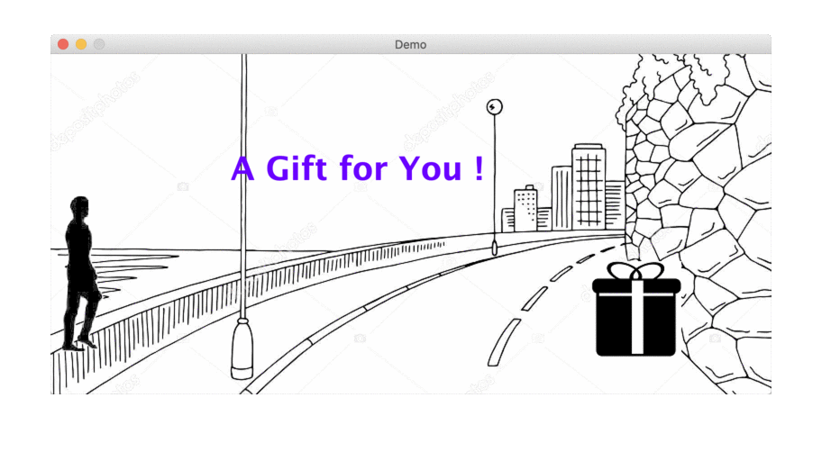

# A Java Game Example

This is an example program I built for students when I was a TA in my master's program.

The codes show how to build a simple game with basic java techniques that includes:
- A game loop
- Role moving by mouse-click and keyboard
- Sounds/music play
- Item vibration
- Simple object collision detection

## Usage (Eclipse)

1. Pull the codes from Github.
2. Download the media resource pack and put it in the project.
  ```
  Media Resource Pack: https://drive.google.com/file/d/1NgkNXlyMiTr4c8xIHUJX6ge1A3HVs2Bx/view?usp=sharing
  ```
3. Set the media resource pack as the "Source Folder".


