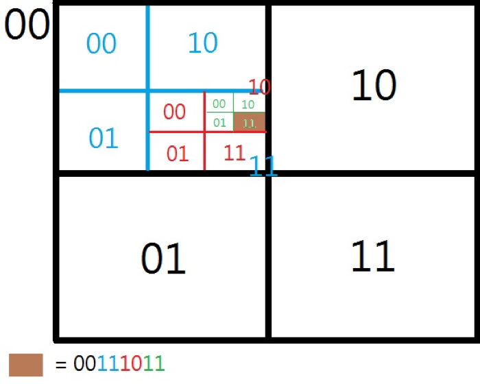
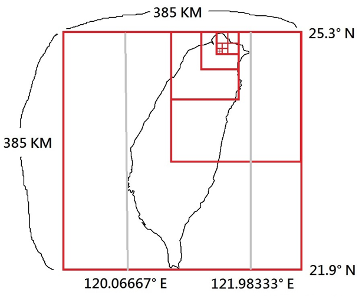

# A Geohash Implementation by PHP with MongoDB

This repository is a PHP module I built for my final project of the bachelor's degree. Our team was implementing a food delivery matching platform, which is like the FoodPandas, UberEats nowadays. The purpose of this module is to find the nearest courier for a given shop.

More details are in the paragraph extracted from our document:  
[第三節 Geohash演算法於本專案之探討與應用.pdf](https://github.com/acker1019/InterviewDemo/blob/master/Geohash-php-mongodb/readme-resource/%E7%AC%AC%E4%B8%89%E7%AF%80%20Geohash%E6%BC%94%E7%AE%97%E6%B3%95%E6%96%BC%E6%9C%AC%E5%B0%88%E6%A1%88%E4%B9%8B%E6%8E%A2%E8%A8%8E%E8%88%87%E6%87%89%E7%94%A8.pdf)

# About Geohash
Geohashing is an application of the quadtree for encoding geographic coordinate. For a given hash code, every two digits stand for a subtree of the parent quadtree.
With the encoding, a specific area can be figured out efficiently.

For an example hash code "00111011",
the brown area can be located, as the picture below.

I know MongoDB supports the Geohash currently, however, it didn't when our project needed it.

# Applying the Geohash to our project

The vertical length of Taiwan is 385,000 m. With 10 cuts (385,000 x 2-10), the areas can be cut down into squares with a length of 376 m. It is a reasonable length for food order matching.

# Why PHP
PHP was chosen because our project server was built with the Nginx server and php-fpm.

# Why MongoDB
In this case, the unknown number of couriers are stored in their own hash grids and their locations are updated rapidly. This situation fits MongoDB's tree-structured data system.

In the case of SQL's table-like data system, A hash code column can be built for "SELECT". However, when executing the "SELECT", the searching is performed "iteratively". It is less efficient than the tree-structured data system.

In other words, "couriers in the same grids" are obtained as bags in MongoDB, on the other hand, "couriers belonging to certain grid" are extracted from a huge table.
