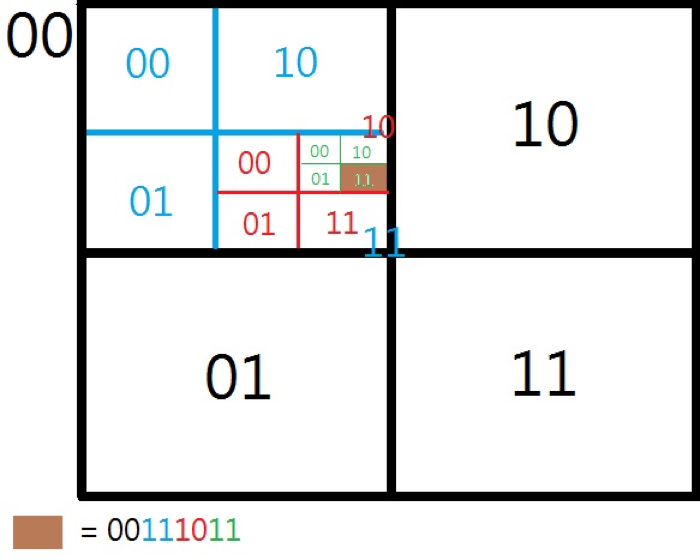
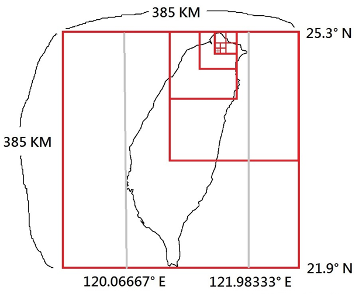

# A Geohash Implementation by PHP with MongoDB

This repository is a PHP module I built for my final project of the bachelor's degree. Our team was implementing a food delivery matching platform, which is like the FoodPandas, UberEats nowadays. The purpose of this module is to find the nearest courier for a given shop.

# About Geohash
Geohashing is an application of the quadtree for encoding geographic coordinate. For a given hash code, every two digits stand for a subtree of the parent quadtree.
With the encoding, a specific area can be figured out efficiently.

For an example hash code "00111011",
the brown area can be located, as the picture below.

I know MongoDB supports the geohash currently, however, it didn't when our project needed it.

# Applying geohash in our project

The vertical length of Taiwan is 385,000 m. With 10 cuts (385,000 x 2-10), the areas can be cut down into squares with a length of 376 m. It is a reasonable length for food order matching.

# Why PHP
PHP was chosen because our project server was built with nginx server and php-fpm.
