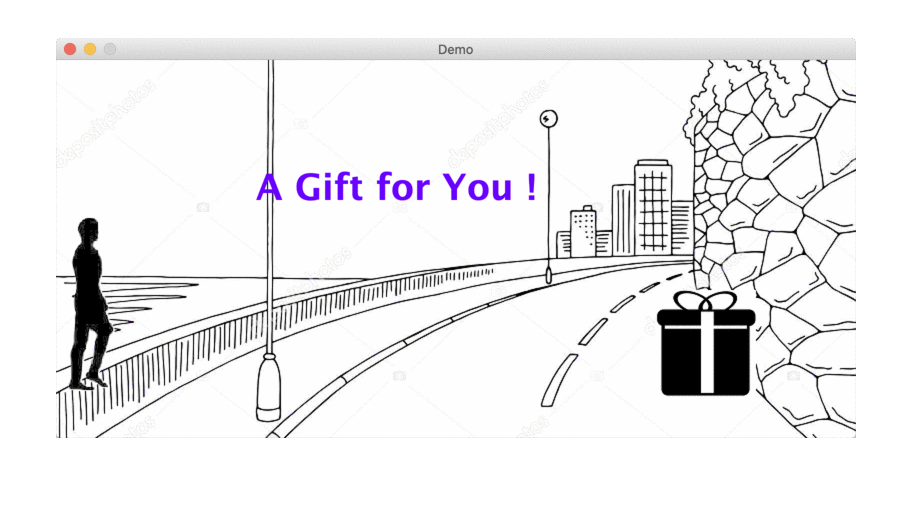
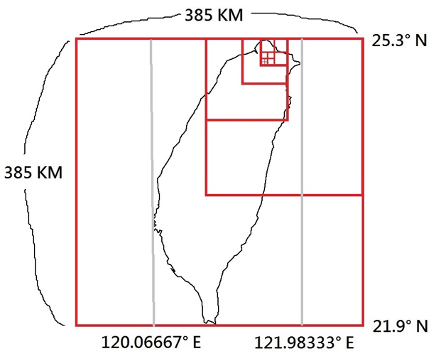

# InterviewDemo
A collection for interview.

## EightQueenWithGUI

Solving Eight Queen Puzzle by Backtracking Dynamic Programming with a GUI.


## GameDemo_v2.0

This is an example program I built for students when I was a TA in my master's program.




## Geohash-php-mongodb

This repository is a PHP module I built for my final project of the bachelor's degree. Our team was implementing a food delivery matching platform, which is like the FoodPandas, UberEats nowadays. The purpose of this module is to find the nearest courier for a given shop.




## StockApriori

For a given set of historical stock prices series, figure out the rise-and-fall association between each price series.

The association rules are sorted by lift in descending order below.
```
...

Association Rules:
[support,	confidence,	lift,		rule
[0.033,		1.0,		30.011,		{IF [1326台化.t2.up.1, 1101台泥.t3.up.1] THEN [1101台泥.t4.down.1, 2382廣達.t5.up.1]} ]
[0.033,		1.0,		30.011,		{IF [1402遠東新.t2.up.1, 2912統一超.t3.up.1] THEN [1216統一.t5.up.1, 1301台塑.t5.down.1]} ]
[0.033,		1.0,		30.011,		{IF [1402遠東新.t2.up.1, 2912統一超.t3.up.1] THEN [1216統一.t5.up.1, 1402遠東新.t5.down.1]} ]
[0.033,		1.0,		30.011,		{IF [1402遠東新.t2.up.1, 2912統一超.t3.up.1] THEN [1216統一.t5.up.1, 1301台塑.t5.down.1, 1402遠東新.t5.down.1]} ]
[0.033,		0.75,		22.508,		{IF [1326台化.t2.up.1, 2308台達電.t2.up.1] THEN [2357華碩.t2.down.1, 1303南亞.t4.up.1]} ]

...
```
